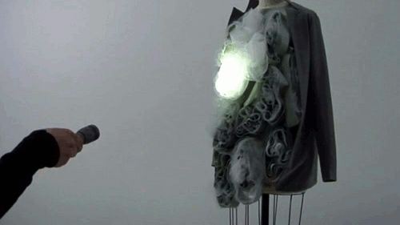
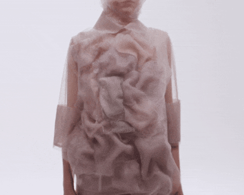

## 3 Josefa Araya

investigaciones individuales

# sobre adafruit io

Adafruit IO de Adafruit, empresa creada por Ladyada, Limor Fried, Adafruit IO es un servicio de nube que te permite trabajar con o sin codigo  
Este servicio no te limita soloa trabajar con el hardware de su marca sino tambien te permite trabajar con casi cualquier dispositivo que pueda enviar info hacia 
el internet

Crearse una cuenta en Adafruit IO es bastante sencillo, se puede hacer con la cuenta de google con unos pocos clicks y se puede acceder gratuitamente a algunas 
cosas para conocer el servicio y probarlo, luego agregar las librerias de Adafruit IO a Arduino IDE tambien es fácil lo que es complejo es hacer que el codigo 
trabaje en la nube (o eso creiamos), resulta que el problema estaba en que teniamos que actualizar la placa Arduino R4 WIFI con la que estabamos trabajando, ya
luego de esto fue sencillo.
Lo que más me gustó de Adafruit IO y Adafruit en general es que comparten todos los recursos, tutoriales, codigos, etc al ser open source.

La nube de Adafuit IO es muy amable y puedes acceder a ella de cualquier servidor, indagando un poco mas descubrí que puedes conectarla a otros servicios como:

- IFTTT para mover la data de Adafruit IO a la web.

- Zapier que conecta diferentes aplicaciones para automatizar tareas repetitivas sin necesidad de saber programar.

- Weather para recibir pronosticos minuto a minuto del clima directamente a tus dispositivos.

- etc

## sobre artista, diseñadora o producto que usa electrónica o computación inalámbricas

# Ying Gao

 **_Programación Cultural_**

Ying Gao es una diseñadora de vestuario y profesora de la Universidad de Quebec de Montreal, fue jefa del programa de moda, accesorios y joyeria en HEAD-Genève 
(Haute école d'art et de design (Escuela Superior de Arte y Diseño)). 
El trabajo creativo de Ying Gao se ha podido ver en medios internacionales como Time, Vogue, The New York Times, Dazed and Confused, Interni, ARTE. Está en la lista de “Fab 40: Canada” seleccionada por Wallpaper magazine, tambien podemos ver su trabajo en el Museo de bellas artes de Montreal y en el museo M+ Hong Kong

>"Su obra da testimonio de la profunda mutación del mundo en que vivimos y conlleva una dimensión crítica radical que trasciende la experimentación tecnológica."

Ying Gao ve el diseño como un medio y cuestiona las fronteras del vestuario y la moda, combinandola con el diseño de productos, media, tecnología, robotica y sociología. 
Sus inspiraciones al construir sus prendas están en la transformación social, el ambiente urbano y también la literatura.

>“Cuando es muy conceptual, pierdo el interes. Estoy atraida al objeto, el material usado, y como puedo usarlo.” - Ying Gao

Seleccioné los tres trabajos que más me llamaron la atención:

1.

2. Possible tomorrows
   

3. Flowing water, Standing time

Ropa robótica que reacciona al espectro cromático

Materiales: silicona, vidrio, PVDF, dispositivos electrónicos

2019

Las prendas reaccionan al contexto, utilizan sensores de color y luz, también pequeñas cámaras conectadas a un computador Raspberry Pi, para recopilar información 
sobre su entorno.

Los datos recopilados activan una serie de transmisores e imanes entrelazados con silicona para provocar que los tejidos se ondulen y se muevan.

Ying Gao sobre este proyecto:

>"Desde el punto de vista técnico y tecnológico, este proyecto se diferencia de los anteriores porque las prendas tienen mucha más autonomía."

>"No solo interactúan con las personas que les rodean, sino también, y especialmente, con su entorno, por lo que el cuerpo humano ya no es el centro del proyecto."

Se inspiró en la novela del neurólogo Oliver Sacks, "The Man who Mistook his Wife for a Hat". En la historia el protagonista, un antiguo marinero, se convence de
que no envejece. Impactado por su propio reflejo cuando Sacks le entrega un espejo, el marinero pierde toda noción de continuidad temporal y vive prisionero de
este momento perpetuo, oscilando entre una presencia en el mundo y una presencia en sí mismo.
Al igual que el personaje, las prendas evolucionan entre dos estados y muestran un cambio perpetuo al reaccionar al espectro cromático. El tránsito entre estados
opuestos, de la inmovilidad al movimiento, no funciona como una dicotomía. Sin embargo, el paso del tiempo añade dinamismo a cada prenda de una manera diferente.
De alguna manera los vestuarios reaccionan a lo que ven.

### Bibliografía

>Gao, Y. (s. f.). ying gao - designer. Ying Gao © 2010. https://yinggao.ca/interactifs/projets-interactifs/

>Gao, Y. (s. f.). ying gao - designer. Ying Gao © 2010. https://yinggao.ca/info/profile/

>Drimonis, T. (2024, 25 enero). A Montreal-Based Designer Makes Fashion Move with Dynamic Garments. Sixtysix. https://sixtysixmag.com/ying-gao-studio-tour/

>Exhibition Catalog. (2016). [Documents]. In Coded_Couture. Pratt Institute Archives Department of Exhibitions Collection. Pratt Institute Libraries Digital Collections. https://jstor.org/stable/community.40382752

>Gao, Y. (s. f.). ying gao - designer. Ying Gao © 2010. https://yinggao.ca/interactifs/flowing-water-standing-time/

