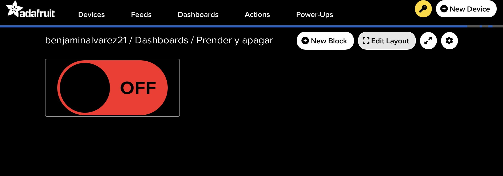
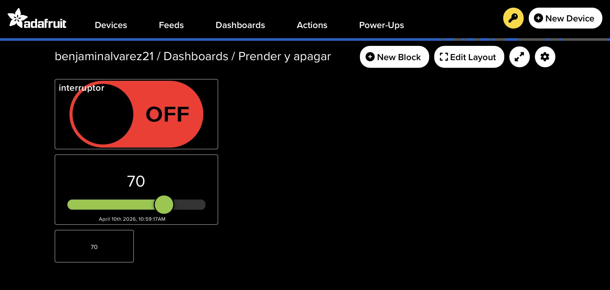

# grupo-11

## Integrantes

* Anays Valentina Cornejo Candia
  
* Benjamín Alonso Álvarez Pavez

## Descripción del proyecto

## Introducción

Al inicio del proyecto, como dupla no sabíamos muy bien qué hacer, estábamos bastante perdidos.

En la última clase, trabajando al unísono con Aarón, fuimos entendiendo mejor el entorno de desarrollo y las posibilidades del Arduino UNO R4 WiFi junto a Adafruit IO.

Dado que todavía no manejamos bien las herramientas, decidimos comenzar con algo simple que nos permitiera comprender lo básico de comunicación entre dispositivos antes de intentar algo más complejo.

## Investigación y elección del proyecto

Revisamos distintos tutoriales de Adafruit IO. A partir de esto, elegimos un ejemplo de encendido y apagado de un LED mediante un dispositivo externo.

En un inicio consideramos otras ideas, pero no las desarrollamos porque aún no contamos con los conocimientos necesarios para implementarlas correctamente.

### Circuito

Se utilizó un Arduino UNO R4 WiFi conectado a una protoboard con la siguiente configuración:

- GND al negativo de la protoboard

- 3.3V al positivo de la protoboard

- Un LED externo conectado entre positivo y negativo


Posteriormente, el LED externo fue reemplazado por el LED integrado de la placa (LED_BUILTIN). Este cambio se realizó debido a que el LED externo no respondía a las instrucciones, por lo que se optó por utilizar el LED integrado.

## Materiales usados en solemne-01

| Componentes Resultado Final | Precio | Cantidad | Link |
| :--------------------------- | ------ | -------- | :---- |
| Arduino UNO R4 Wifi         | $38.990 | x1      | <https://mcielectronics.cl/shop/product/43402/> |
| Cable C a C                 | $14.990 | x1      | <https://www.falabella.com/falabella-cl/product/149750952/> |

| Componentes Proceso | Precio | Cantidad | Link |
| :------------------ | ------ | -------- | :---- |
| Protoboard          | $1.500 | x1       | <https://afel.cl/products/mini-protoboard-400-puntos> |
| Cable Dupont (pack 40 uni.) | $2.900 | x4       | <https://mcielectronics.cl/shop/product/cable-dupont> |
| Led                 | $70    | x1       | <https://afel.cl/products/diodo-led-5mm-ultrabrillante-blanco> |

## Códigos y funcionamiento

### Código .ino

Este código controla el funcionamiento del LED según los datos que recibe desde Adafruit IO.

```cpp
#include "config.h"

// Crear feed (nombre: led)
AdafruitIO_Feed *led = io.feed("led");

// Pin del LED
int ledPin = LED_BUILTIN;

void setup() {
  Serial.begin(115200);
  pinMode(ledPin, OUTPUT);

  // Conectar a Adafruit IO
  Serial.print("Conectando...");
  io.connect();

  // Esperar conexión
  while (io.status() < AIO_CONNECTED) {
    Serial.print(".");
    delay(500);
  }

  Serial.println();
  Serial.println("Conectado a Adafruit IO");

  // Escuchar cambios en el feed
  led->onMessage(handleMessage);

  // Obtener último valor guardado
  led->get();
}

void loop() {
  io.run();
}

// Función que se ejecuta cuando llega dato
void handleMessage(AdafruitIO_Data *data) {
  Serial.print("Valor recibido: ");
  Serial.println(data->value());

  String value = data->value();

  if (value == "ON") {
    digitalWrite(ledPin, HIGH);
  }
  else if (value == "OFF") {
    digitalWrite(ledPin, LOW);
  }
}
```

### Código config.h

Este código contiene los datos necesarios para conectarse a la red WiFi y a Adafruit IO, como el nombre de la red, la contraseña y las claves de usuario.

```cpp
// Librería
#include "AdafruitIO_WiFi.h"

// 🔐 Tus datos (CAMBIAR si es necesario)
#define WIFI_SSID "monkiboy"
#define WIFI_PASS "benja123"

#define IO_USERNAME "benjaminalvarez21"
#define IO_KEY "bla bla"


// ESP32 / ESP8266 / UNO R4 WiFi (caso más común)
AdafruitIO_WiFi io(IO_USERNAME, IO_KEY, WIFI_SSID, WIFI_PASS);
```

## Problemas y ajustes

Durante el desarrollo surgió un problema, el sistema recibía los datos correctamente, pero el LED no respondía a las instrucciones.

#### Primer intento usando LED externo, donde se recibían datos pero el LED no respondía


Para resolverlo, se decidió reemplazar el LED externo por el LED integrado (LED_BUILTIN). Este cambio permitió que el sistema funcionara correctamente.

#### Funcionamiento correcto utilizando el LED integrado del Arduino.

[](https://www.youtube.com/watch?v=q9Ajooq1Ip0)

#### Comunicación con Adafruit IO

El Arduino se conectó al computador, mientras que las instrucciones se enviaban desde un iPad a través de un dashboard en Adafruit IO.

Se trabajó con dos comandos principales:

- ON, para encender el LED

- OFF, para apagar el LED

Los valores enviados desde el dashboard se registraban en un feed, el cual permitía visualizar el estado del sistema en tiempo real.

#### Imagen del dashboard de Adafruit IO con bloques ON/OFF



#### Registro en Adafruit IO del encendido y apagado del LED


## Funcionalidades exploradas

Además del funcionamiento principal del LED, hicimos experimentaciones con otras herramientas del dashboard de Adafruit IO para explorar.

Primero, probamos el envío de mensajes desde el dashboard, los cuales se visualizan tanto en el monitor serial como en el feed de Adafruit IO.

#### Prueba de envío de mensajes desde Adafruit IO al monitor serial

[](https://www.youtube.com/watch?v=bQc3ydI18RI)

También utilizamos un slider que permite enviar valores numéricos y observar su comportamiento en un gráfico dentro de Adafruit IO.

#### Visualización de valores enviados desde el slider en el gráfico de Adafruit IO


#### Dashboard completo



Estas pruebas corresponden a exploraciones realizadas durante el proceso de aprendizaje y no forman parte del sistema final.

## Conclusión

Este proyecto nos ayudó a entender cómo se comunica un dispositivo físico con una plataforma en la nube. A partir de algo sencillo, aprendimos las bases para hacer proyectos más complejos en el futuro. También vimos la importancia de ordenar bien el código y la documentación, y de enfocarnos en lo principal del programa. Poco a poco vamos entendiendo mejor cómo funciona el Arduino y Adafruit IO, y las posibilidades que tienen. Estamos muy motivados y emocionados de realizar las nuevas ideas que tenemos en mente.

## Investigaciones individuales

[persona-01.md](./persona-01.md) Anays Cornejo

[persona-02.md](./persona-02.md) Benjamín Álvarez

## Bibliografía

<https://learn.adafruit.com/series/adafruit-io-basics>

<https://learn.adafruit.com/adafruit-io-basics-digital-output>
