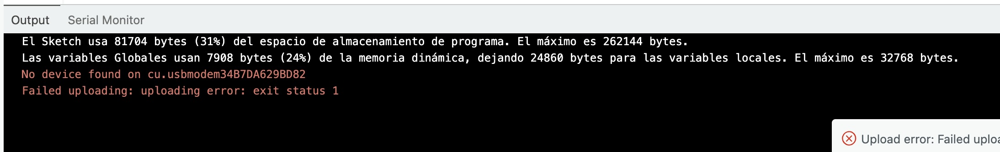
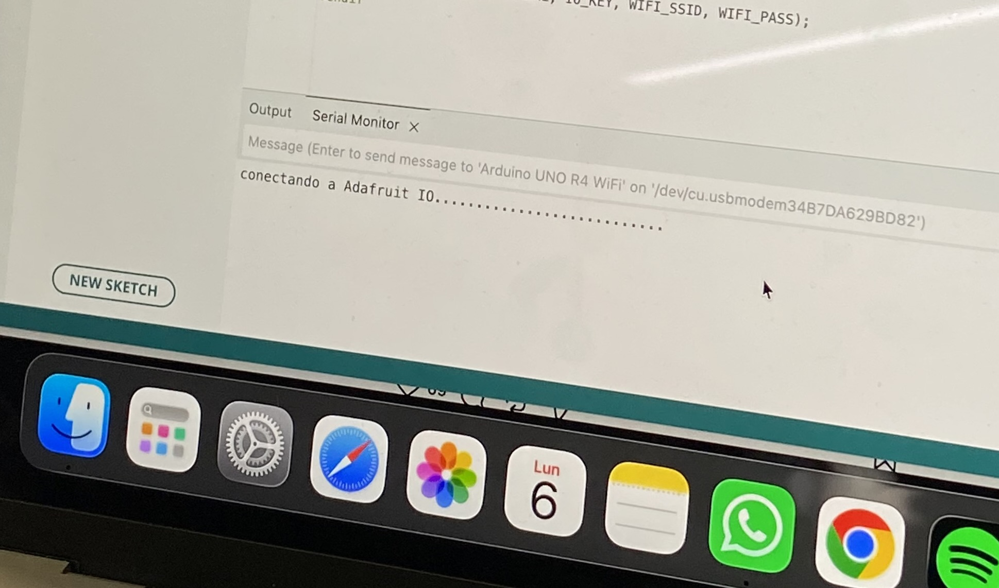
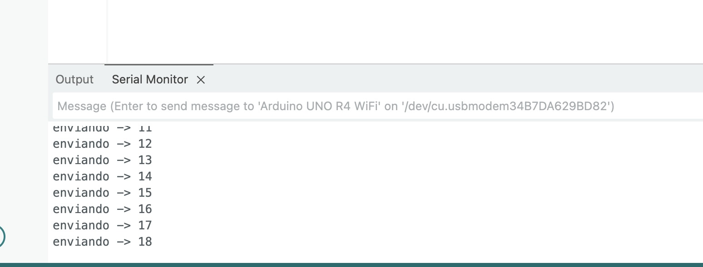
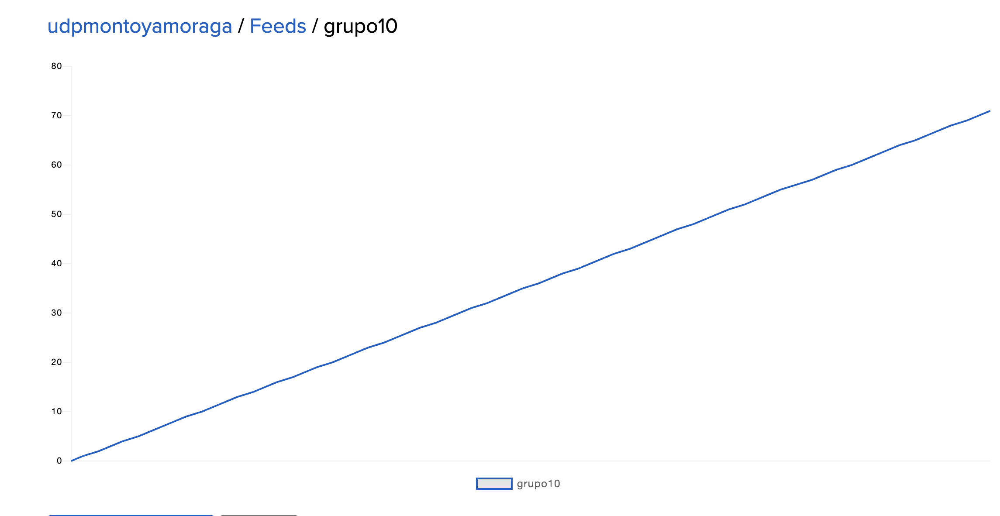
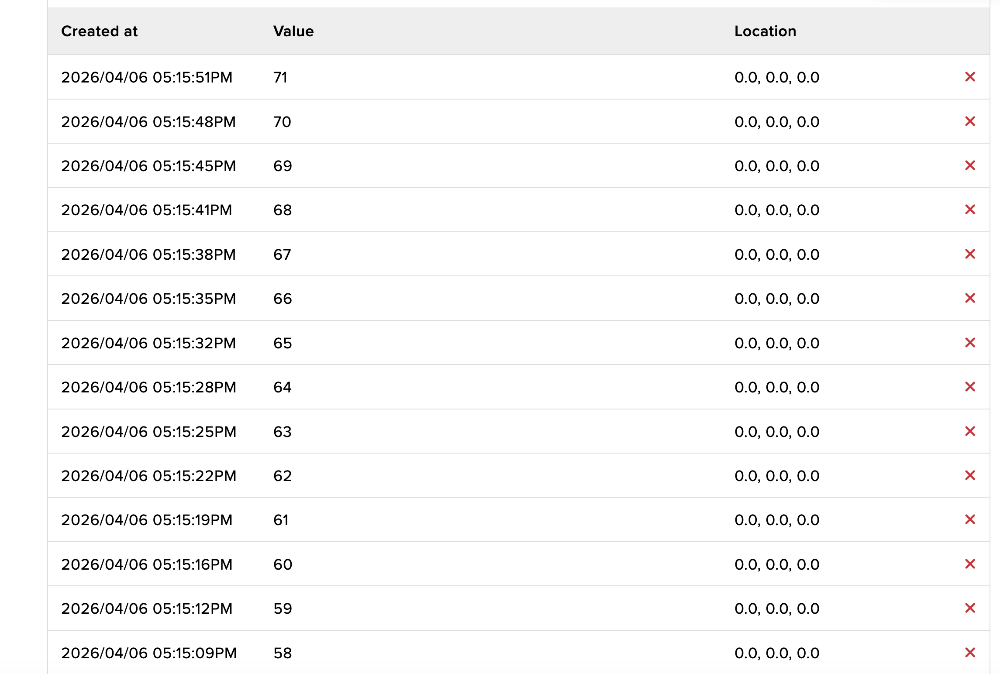

# sesion-05

lunes 06 abril 2026

Adafruit IO - Arduino

Adafruit: Plataforma que permite recibir los mensajes mandados desde Arduino
Un servicio en la nube de Adafruit para desarrollar proyectos de Internet. Permite a los usuarios conectar, monitorear y controlar dispositivos y sensores IoT en línea sin escribir una sola línea de código.

Necesario crearse una cuenta, mantener las claves y nombres privados.

Feeds: Donde se guardan datos

Dashboard: Interfaz visual donde ves esos datos

## Documentación solemne

Mandar mensajes por Arduino y hacer que la información sea recibida por Adafruit vía feeds y dashboard

* Creamos la cuenta adafruit, nuestra cuenta personal para hacer pruebas, para subir la solemne usar las credenciales de aarón para luego recibir como se está mostrando la información.
  
* Mandamos el código desde Arduino pero nos aparece un error, lo logramos solucionar cambiando el wifi a uno que tuviera un nombre de una sin espacios y que fuera de una palabra nos recomendó aaron con mateo.

  

* Probamos con el personal hotspot de Aarón y se nos logró conectar a Adafruit IO, recibimos la informacion y la logramos documentar en adafruit.

  
  
  
  

## Bibliografía

Adafruit Industries. Welcome to Adafruit IO.
<https://io.adafruit.com/welcome>
