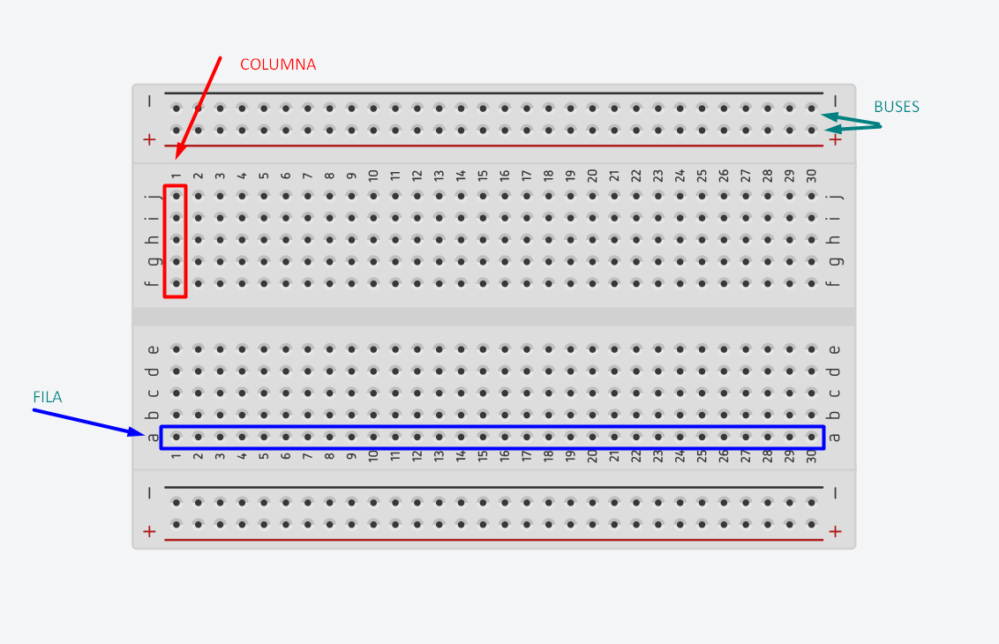
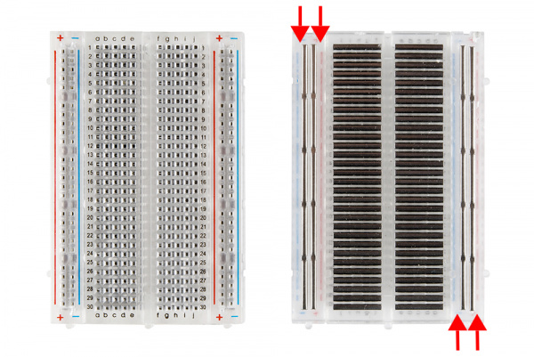
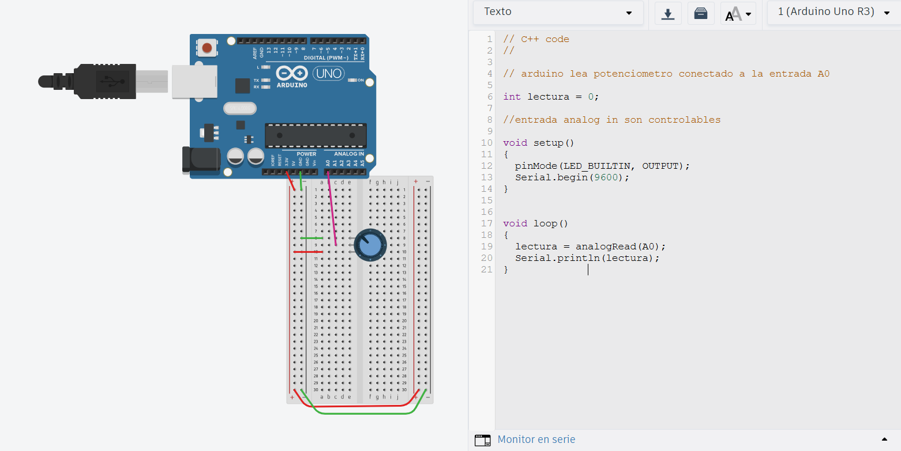

# sesion-07
vamos  a usar un motor servo 

veremos estrategias para promediar datos

se nos entrega como grupo, motor servo, otra protoboar, un potenciómetro, un LDR (fotorresistor) 

del potenciometro se conecta la patita 1 y la 2 o la 2 y la 3 nunca los dos extremos patita de al medio analog in 

LDR reacciona a la luz 

Motor servo: 3 terminales  permite comportamientos extraños según Aarón


como conectar una protoboard

sección de alimentación es opcional usarla 

positivo cable rojo, lo que sea que conectemos que esté a los dos lados




Protoboard por dentro:



<https://www.tinkercad.com/>

Ejemplo lectura potenciometro



```
// C++ code
//

// arduino lea potenciometro conectado a la entrada A0

int lectura = 0;

//entrada analog in son controlables
  
void setup()
{
  pinMode(LED_BUILTIN, OUTPUT);
  Serial.begin(9600);
}


void loop()
{
  lectura = analogRead(A0);
  Serial.println(lectura);
}             

```

Ejemplo potenciometro con servomotor

```

// ejemplo lectura potenciometro

// queremos que nuestro Arduino
// sea capaz de leer un potenciometro
// conectado a la entrada A0.


#include <Servo.h>


Servo miServo;

int lectura = 0;
int angulo = 0;


void setup()
{
  pinMode(9, OUTPUT);
  Serial.begin(9600);
  // en que patita esta conectado el servo
  // conectemos a patita 9 digital
  miServo.attach(9);
  
}

void loop()
{
  // leer
  lectura = analogRead(A0);
  
  // imprimir en consola
  Serial.println(lectura);
  
  
  // toma el valor de lectura
  // que va originalmente entre 0 y 1023
  // y mapealo al rango 0 a 180
  angulo = map(lectura, 0, 1023, 0, 180);
    
  // pidele por favor al servo
  // que vaya a ese angulo
  miServo.write(angulo);
  
  // servo descansa un poquito
  // 15 milisegundos
  // la vida es dura
  delay(15);
    
}

```

código primero define cosas

cable naranjo señal

```

// ejemplo lectura potenciometro

// queremos que nuestro Arduino
// sea capaz de leer un potenciometro
// conectado a la entrada A0.


#include <Servo.h>


Servo miServo;

int lectura = 0;
int anguloActual = 0;
int anguloDeseado = 0;

bool saludar = false;


void setup()
{
  pinMode(9, OUTPUT);
  Serial.begin(9600);
  // en que patita esta conectado el servo
  // conectemos a patita 9 digital
  miServo.attach(9);
  
}

void loop()
{
  // leer
  lectura = analogRead(A0);
  
  // imprimir en consola
  Serial.println(lectura);
  
  
  // toma el valor de lectura
  // que va originalmente entre 0 y 1023
  // y mapealo al rango 0 a 180
  // anguloActual = map(lectura, 0, 1023, 0, 180);
  
  
  if (lectura > 700) {
    saludar = true;
  }
  else {
    saludar = false;
  }
  
  
  if (saludar) {
    // lo que pasa cuando hay que saludar
    moverLaManitoTimidamente();
  }
  else {
    // lo que pasa cuando NO :(
    meCohibi();
  } 
    
}


void moverLaManitoTimidamente() {
  
  if (anguloActual < 90 )
  {
    miServo.write(anguloActual);
    anguloActual++;
     // servo descansa un poquito
     // 15 milisegundos
     // la vida es dura
    delay(15);
  }
  

}


void meCohibi() {
  anguloActual--;
  miServo.write(anguloActual);
  delay(15);
}
```

como reemplazar potenciometro por 

```

#include <WiFiS3.h>
#include "Adafruit_MQTT.h"
#include "Adafruit_MQTT_Client.h"

// ── Credenciales ───────────────────────────────────────────
#define WIFI_SSID    "bla"
#define WIFI_PASS    "bla"
#define AIO_SERVER   "io.adafruit.com"
#define AIO_PORT     1883
#define AIO_USERNAME "udpmontoyamoraga"
#define AIO_KEY      "aio KEY"
#define AIO_FEED     AIO_USERNAME "/feeds/ldr_09"

#define INTERVALO_PUBLISH 500

WiFiClient wifiClient;
Adafruit_MQTT_Client mqtt(&wifiClient, AIO_SERVER, AIO_PORT, AIO_USERNAME, AIO_KEY);
Adafruit_MQTT_Publish feedPot(&mqtt, AIO_FEED);

int lecturaAnterior = -1;
unsigned long ultimoPublish = 0;

void conectarMQTT() {
  while (!mqtt.connected()) {
    Serial.print("Conectando a Adafruit IO...");
    int8_t ret = mqtt.connect();
    if (ret == 0) {
      Serial.println(" OK");
    } else {
      Serial.print(" Error: ");
      Serial.println(mqtt.connectErrorString(ret));
      mqtt.disconnect();
      delay(3000);
    }
  }
}

int lectura = 0;

void setup() {
  Serial.begin(115200);


  Serial.print("Conectando WiFi");
  WiFi.begin(WIFI_SSID, WIFI_PASS);
  while (WiFi.status() != WL_CONNECTED) {
    delay(500);
    Serial.print(".");
  }
  Serial.print(" IP: ");
  Serial.println(WiFi.localIP());
}

void loop() {
  conectarMQTT();
  mqtt.ping();

 lectura = analogRead(A0);
  Serial.println(lectura);

  unsigned long ahora = millis();
  if (lectura != lecturaAnterior && (ahora - ultimoPublish >= INTERVALO_PUBLISH)) {
    Serial.print("Publicando lectura: ");
    Serial.println(lectura);

    if (feedPot.publish((int32_t)lectura)) {
      Serial.println("  ✓ OK");
      lecturaAnterior = lectura;
      ultimoPublish   = ahora;
    } else {
      Serial.println("  ✗ Fallo");
    }
  }

  delay(15);
}
```

lunes 20 abril 2026
