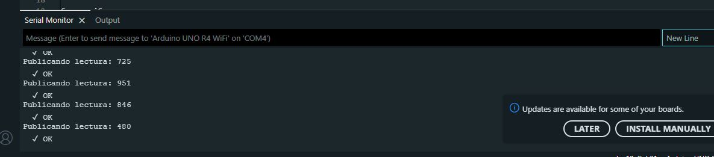
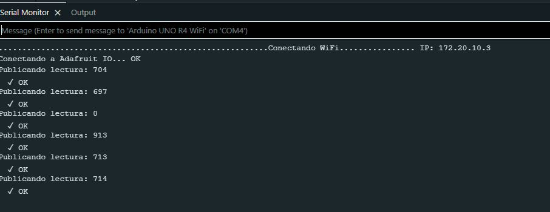

# sesion-07

lunes 20 abril 2026

## primera parte

ocuparemos servo, proto, LDR y potenciómetro para hacer cosas con arduino

el servor tiene 3 cables, uno es para alimentación, otro es tierra y el otro es el pin para decirle "servo haz esto"

veremos materia directamente desde el libro que está haciendo aarón con misaa sobre electrónica, veremos el capítulo 13 de: componentes básicos

este libro lo podemos encontrar en dis udp en github, debería aparecer

en la protoboard el lado izquierdo es independiente del derecho, lo atraviesa la zanja lol, entonces lo divide

arduino a veces ocupa 5v o 3.3v, hay microcontroladores que utilizan 3,3v porque a veces si más voltaje hay, funcionan peor

lo que yo conecte en 1a se propaga hacia 1b, 1c, 1d, 1e. 1f está al otro lado del río por lo tanto no se propaga hasta allá

- primero conectaremos un potenciómetro al arduino

las patitas son programables

ajustar el potenciómetro para establecer 0 como mínimo y 1023 como máximo

código para lectura

```cpp
// ejemplo lectura potenciometro

// queremos que nuestro Arduino
// sea capaz de leer un potenciometro
// conectado a la entrada A0.

int lectura = 0;


void setup()
{
  pinMode(LED_BUILTIN, OUTPUT);
  Serial.begin(9600);
}

void loop()
{
  lectura = analogRead(A0);
  Serial.println(lectura);
}
```

- este primer código nos permite ver números de 0 a 1023 en el monitor serial mediante la manipulación del potenciómetro


así se ven los datos que nos envía

**(pendiente subir gif del potenciómetro girando y los datos cambiando en tiempo real)**

- ahora añadiremos el servo?

- primero haremos que el potenciómetro controle el servo de modo alámbrico y después lo haremos inalámbrico

- si la patita no tiene sinusoide, no puede mover el servo, es este símbolo en el hardware de arduino ( ~ ) en este caso la patita de señal del servo es patita que debe ir conectado a los pines que tengan ese símbolo, lo conectaremos al pin 9 del arduino ~


**código 2**

```cpp
// ejemplo lectura potenciometro

// queremos que nuestro Arduino
// sea capaz de leer un potenciometro
// conectado a la entrada A0.


#include <Servo.h>


Servo miServo;

int lectura = 0;
int angulo = 0;


void setup()
{
  pinMode(9, OUTPUT);
  Serial.begin(9600);
  // en que patita esta conectado el servo
  // conectemos a patita 9 digital
  miServo.attach(9);
  
}

void loop()
{
  // leer
  lectura = analogRead(A0);
  
  // imprimir en consola
  Serial.println(lectura);
  
  
  // toma el valor de lectura
  // que va originalmente entre 0 y 1023
  // y mapealo al rango 0 a 180
  angulo = map(lectura, 0, 1023, 0, 180);
    
  // pidele por favor al servo
  // que vaya a ese angulo
  miServo.write(angulo);
  
  // servo descansa un poquito
  // 15 milisegundos
  // la vida es dura
  delay(15);
    
}
```

- este código permite girar el servo mediante el potenciómetro, es bacán

- **pendiente subir el video de la prueba de esto**

## break

- vuelta de break

ahora utilizaremos un código para poder mover de forma inalámbrica el servo parece

- usaremos el código similar al que hicieron, cambiaremos el "mateo" por el nombre del grupo de solemne 2, en este caso potenciometro-10

```cpp
#include <Servo.h>
#include <WiFiS3.h>
#include "Adafruit_MQTT.h"
#include "Adafruit_MQTT_Client.h"

// ── Credenciales ───────────────────────────────────────────
#define WIFI_SSID    "bla"
#define WIFI_PASS    "bla"
#define AIO_SERVER   "io.adafruit.com"
#define AIO_PORT     1883
#define AIO_USERNAME "secreto"
#define AIO_KEY      "
#define AIO_FEED     AIO_USERNAME "/feeds/potenciometro-mateo"

#define INTERVALO_PUBLISH 500

Servo miServo;
WiFiClient wifiClient;
Adafruit_MQTT_Client mqtt(&wifiClient, AIO_SERVER, AIO_PORT, AIO_USERNAME, AIO_KEY);
Adafruit_MQTT_Publish feedPot(&mqtt, AIO_FEED);

int lecturaAnterior = -1;
unsigned long ultimoPublish = 0;

void conectarMQTT() {
  while (!mqtt.connected()) {
    Serial.print("Conectando a Adafruit IO...");
    int8_t ret = mqtt.connect();
    if (ret == 0) {
      Serial.println(" OK");
    } else {
      Serial.print(" Error: ");
      Serial.println(mqtt.connectErrorString(ret));
      mqtt.disconnect();
      delay(3000);
    }
  }
}

void setup() {
  Serial.begin(115200);
  miServo.attach(9);

  Serial.print("Conectando WiFi");
  WiFi.begin(WIFI_SSID, WIFI_PASS);
  while (WiFi.status() != WL_CONNECTED) {
    delay(500);
    Serial.print(".");
  }
  Serial.print(" IP: ");
  Serial.println(WiFi.localIP());
}

void loop() {
  conectarMQTT();
  mqtt.ping();

  int lectura = analogRead(A0);
  int angulo  = map(lectura, 0, 1023, 0, 180);
  miServo.write(angulo);

  unsigned long ahora = millis();
  if (lectura != lecturaAnterior && (ahora - ultimoPublish >= INTERVALO_PUBLISH)) {
    Serial.print("Publicando lectura: ");
    Serial.println(lectura);

    if (feedPot.publish((int32_t)lectura)) {
      Serial.println("  ✓ OK");
      lecturaAnterior = lectura;
      ultimoPublish   = ahora;
    } else {
      Serial.println("  ✗ Fallo");
    }
  }

  delay(15);
}
```

- 16:52 tenemos problemas para conectarnos en wifi

- buscar cómo reemplazar el potenciómetro en este circuito por el LDR

- en el final de la clase conectamos el arduino al wifi de mateo y funcionó, apareció que se conectó y enviaba datos con el potenciómetro. El único problema de momento es que a mateo no le aparece nuestro feed de grupo 10 en adafruit



**actualización 17:44**


- probamos nuevamente, aparecen nuevamente los datos siendo enviados



- funcionó ahora sí, fui al lid con mateo y aarón , probamos conectarnos nuevamente y ahora nos detectó en los feeds, potenciómetro grupo 10!!!

- observaciones: puede que no nos funcionara en la sala porque estábamos al fondo de la sala y porque había mucha gente, dispositivos, las cosas se crashean igual, para la otra sentarse adelante, nunca más atrás


