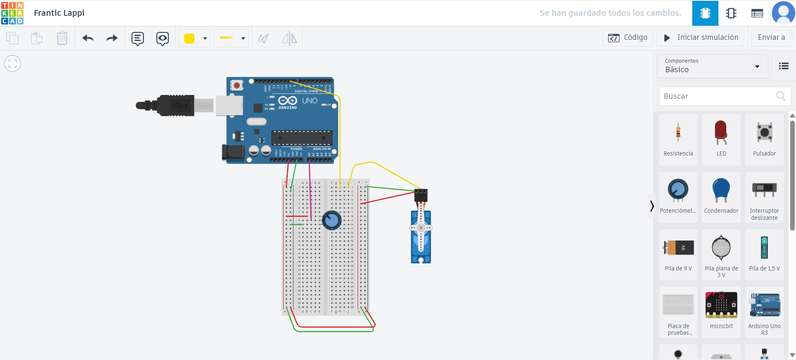
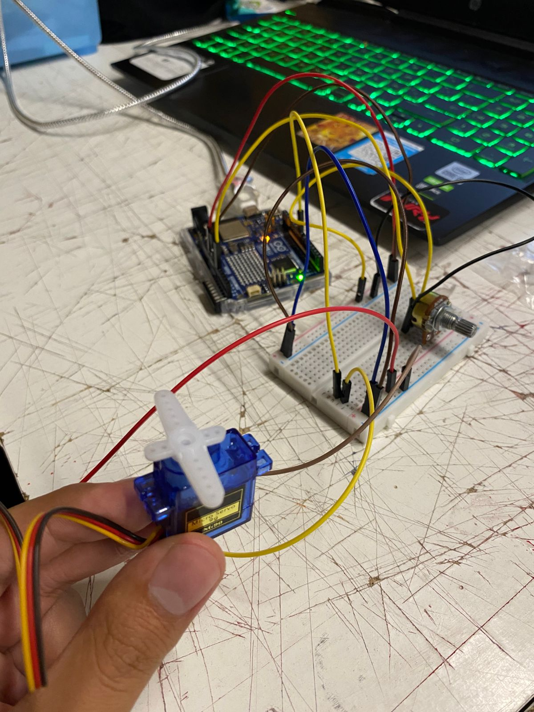

# sesion-07

lunes 20 abril 2026

# Solemne 02

Aarón nos entrega materiales para comenzar con la Solemne 02: 
- Protoboard
- Cables
- Motor Servo
- Potenciomentro
- LDR

## Protoboard
En Estados Unidos se le conoce como Breadboard, en cambio en Chile recibe el nomnbre de Protoboartd.

Hicimos pruebas en clase con la Protoboard y Arduino, con el apoyo visual de TinkerCad, generando así las conexiones con los cables, en conjunto con el Potenciometro, con el fin de hacer funcionar el Motor Servo y que este de vueltas a medida que uno va manipulando la perilla del Potenciometro, teniendo en cuenta las conexiones en los positivos y negativos.

## Tinkercad:

## Proceso:

## Pruebas en clase:

 

se logró 

Cómo cambiar/reemplazar el potenciomaetro por un LDR?

