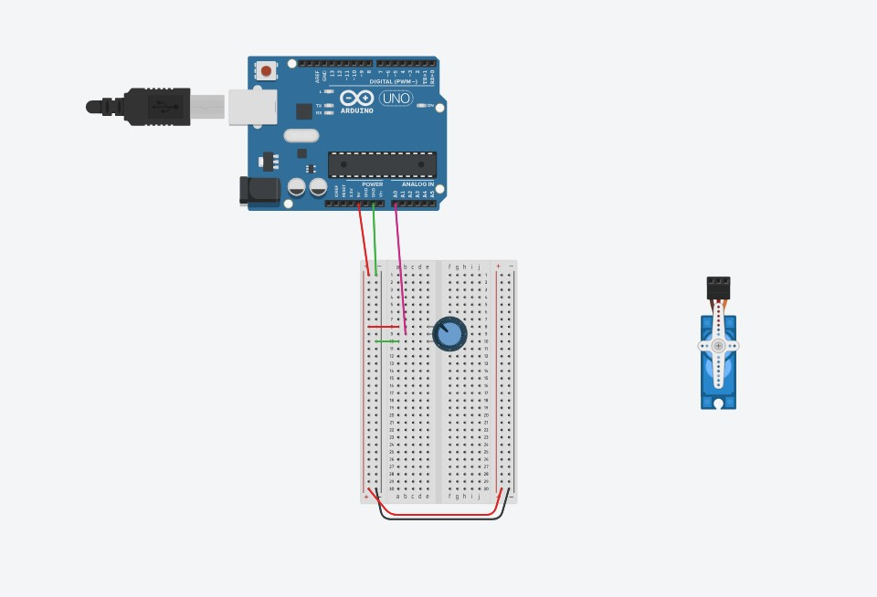

# sesion-07

lunes 20 abril 2026

## apuntes 

+ potenciometro: tener un componente que va a detectar nuestro giro, una de las patas es positiva 
+ LDR: funcionan con luz, son poco estables pero si le subimos la luz pasa por todos los valores intermedios
+ protoboard: dispositivo con muchos puntos, circulan electrones que nosotros no vemos, area con numeros y letras que nos ayudan a ver las conexiones de forma ordenada, tiene dos secciones principales, + y -, si se conecta al + se propaga a todos los rojos, - a todos los azules 
+ cables 
+ motor: servos son para hacer cosas muy sutiles, nos permiten comportamientos extraños. tiene tres terminales, la amarilla indica lo que queremos que haga

- tinkercad!! cad: diseño asistido por computadoras 

