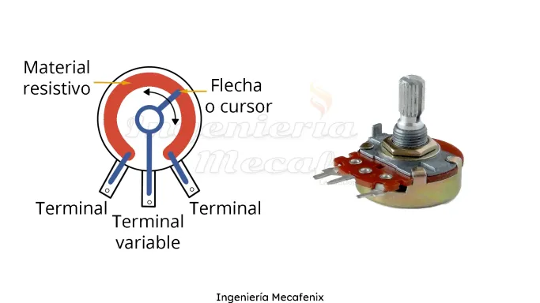
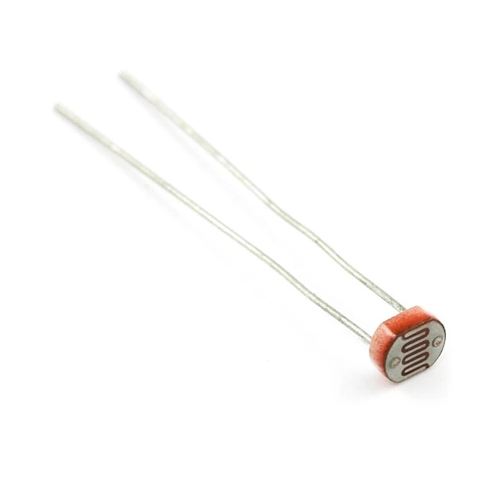
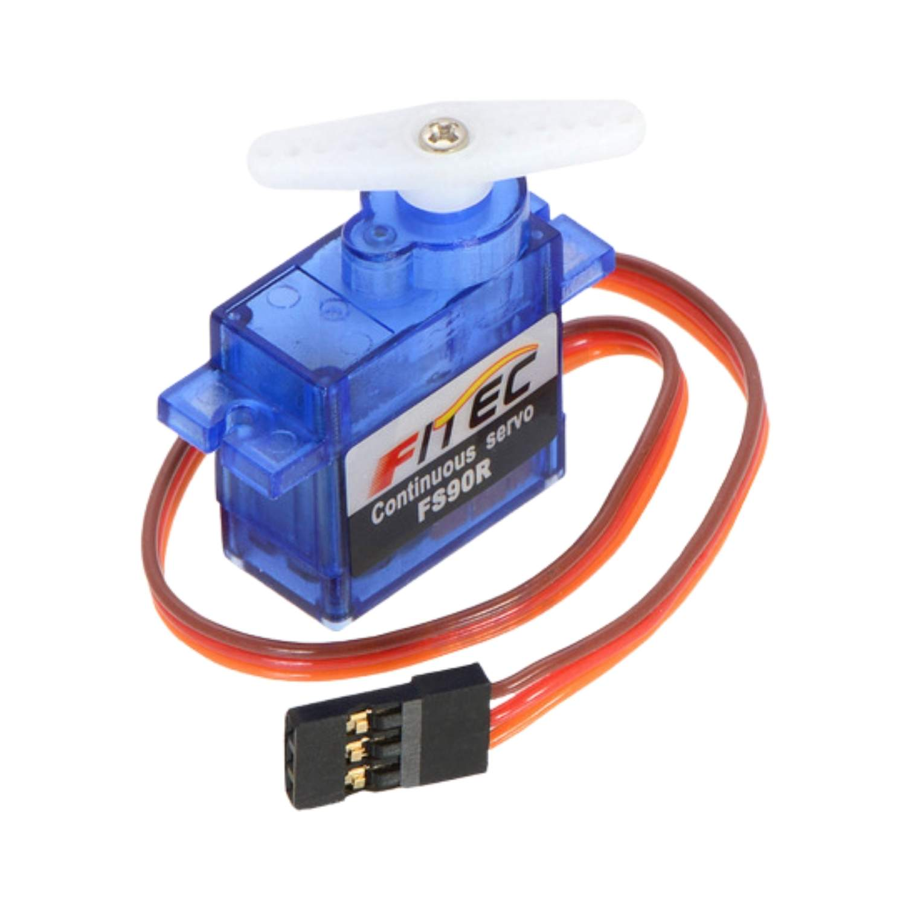
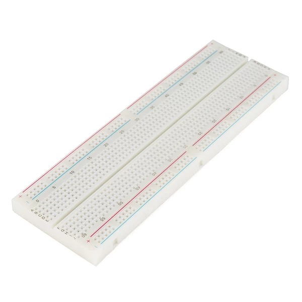
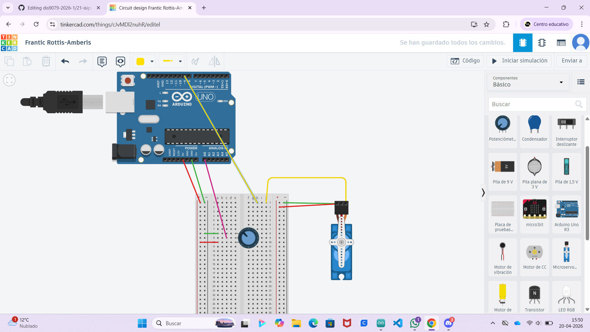
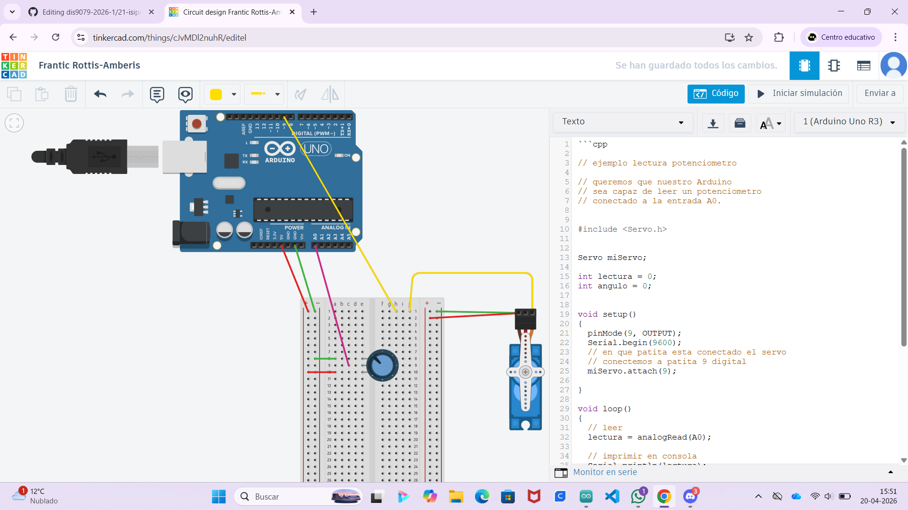
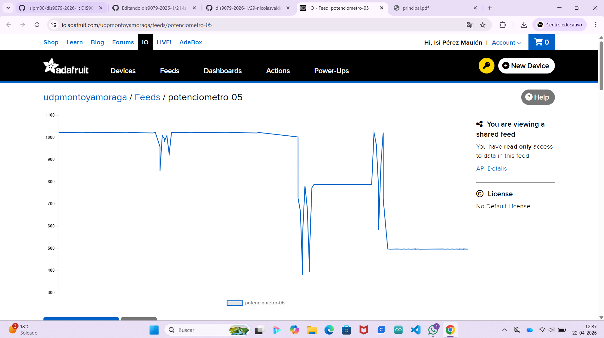

# sesion-07

lunes 20 abril 2026

## Potenciómetro 
+ Componente eléctronico pasivo, actúa como resistencia variable manualmente
+ 3 terminales: modifica resistencia eléctrica de un circuito
+ Permite controlar intensidad, corriente y voltaje

 
 
## LDR
+ Componente eléctronico cuya resistencia varía de forma inversamente proporcional a la luz
+ Más luz menor resistencia - mayor oscuridad mayor resistencia



## Servo
+ Tres terminales 
  - Alimentación (rojo) 
  - Tierra (negro /café)
  - Donde se dirige, le llega la instrucción, comunicación (amarilla)
+ Usa retoalimentación (potenciómetro + circuito eléctrico) para girar a ángulos específicos o mantener su posición



## Protoboard (breadboard) 
+ Placa de pruebas
+ Ensambla y testea circuitos sin necesidad de soldar
+ Prototipado de forma fugaz
+ Arduino power bredboard
+ Positivo (rojo) mismo metal de forma vertical "alimentación"
+ Negativo (negro verde café) mismo metal de forma vertical
+ a b c d e: mismo metal de forma horizontal
+ f g h i j: mismo metal de forma horizontal
+ GND: TIERRA



## Cad
computer aided design

## Tinkercad
+ Realizamos el circuito simulado en tinkercad, de esta forma es más fácil graficarlo para luego probarlo.






## Código mover la manito :)
```cpp

// ejemplo lectura potenciometro

// queremos que nuestro Arduino
// sea capaz de leer un potenciometro
// conectado a la entrada A0.


#include <Servo.h>


Servo miServo;

int lectura = 0;
int anguloActual = 0;
int anguloDeseado = 0;

bool saludar = false;


void setup()
{
  pinMode(9, OUTPUT);
  Serial.begin(9600);
  // en que patita esta conectado el servo
  // conectemos a patita 9 digital
  miServo.attach(9);
  
}

void loop()
{
  // leer
  lectura = analogRead(A0);
  
  // imprimir en consola
  Serial.println(lectura);
  
  
  // toma el valor de lectura
  // que va originalmente entre 0 y 1023
  // y mapealo al rango 0 a 180
  // anguloActual = map(lectura, 0, 1023, 0, 180);
  
  
  if (lectura > 700) {
    saludar = true;
  }
  else {
    saludar = false;
  }
  
  
  if (saludar) {
    // lo que pasa cuando hay que saludar
    moverLaManitoTimidamente();
  }
  else {
    // lo que pasa cuando NO :(
    meCohibi();
  } 
    
}


void moverLaManitoTimidamente() {
  
  if (anguloActual < 90 )
  {
    miServo.write(anguloActual);
    anguloActual++;
     // servo descansa un poquito
     // 15 milisegundos
     // la vida es dura
    delay(15);
  }
  

}


void meCohibi() {
  anguloActual--;
  miServo.write(anguloActual);
  delay(15);
}
```

## Código Servo 
```cpp

// ejemplo lectura potenciometro

// queremos que nuestro Arduino
// sea capaz de leer un potenciometro
// conectado a la entrada A0.


#include <Servo.h>


Servo miServo;

int lectura = 0;
int angulo = 0;


void setup()
{
  pinMode(9, OUTPUT);
  Serial.begin(9600);
  // en que patita esta conectado el servo
  // conectemos a patita 9 digital
  miServo.attach(9);
  
}

void loop()
{
  // leer
  lectura = analogRead(A0);
  
  // imprimir en consola
  Serial.println(lectura);
  
  
  // toma el valor de lectura
  // que va originalmente entre 0 y 1023
  // y mapealo al rango 0 a 180
  angulo = map(lectura, 0, 1023, 0, 180);
    
  // pidele por favor al servo
  // que vaya a ese angulo
  miServo.write(angulo);
  
  // servo descansa un poquito
  // 15 milisegundos
  // la vida es dura
  delay(15);
    
}
```

## Código potenciómetro
```cpp
// ejemplo lectura potenciometro

// queremos que nuestro Arduino
// sea capaz de leer un potenciometro
// conectado a la entrada A0.

int lectura = 0;


void setup()
{
  pinMode(LED_BUILTIN, OUTPUT);
  Serial.begin(9600);
}

void loop()
{
  lectura = analogRead(A0);
  Serial.println(lectura);
}
