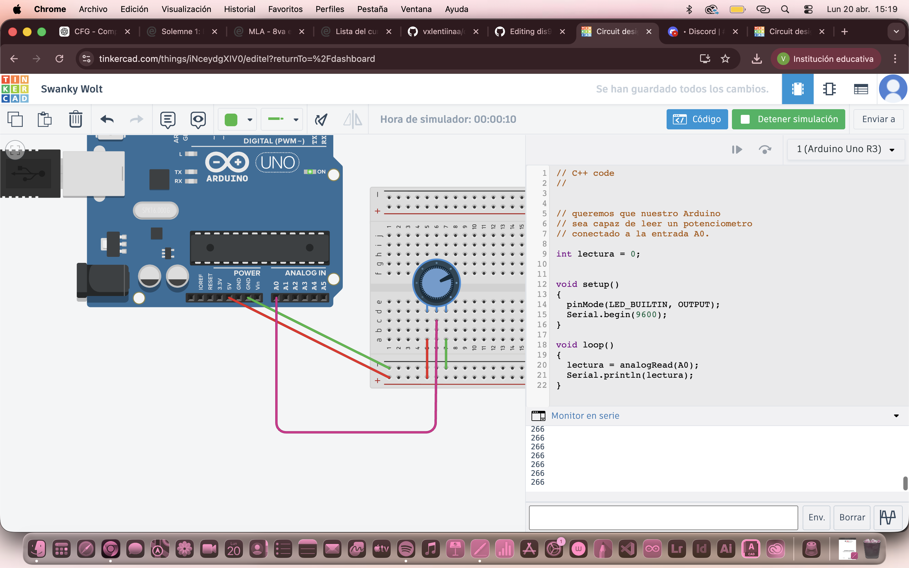
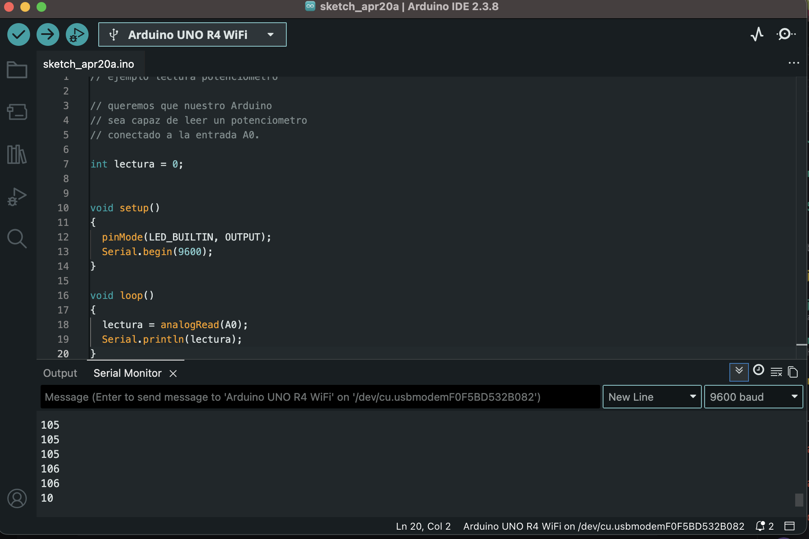
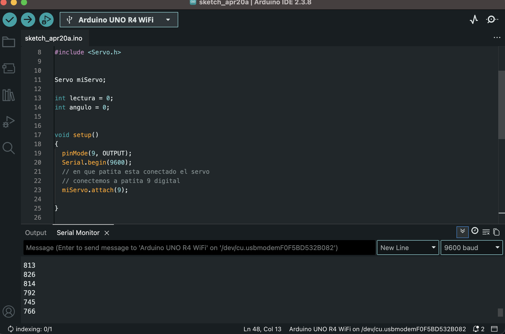

# sesion-07

lunes 20 abril 2026

---

## Apuntes

`Seremos el grupo 8, mismo grupo:` Sofía Cartes, Monserrat Paredes, Valentina Ruz.

Nos dieron materiales nuevos:

- Potenciómetro: siempre usaremos la patita 2 y uno de los extremos, nunca usar los extremos juntos.
- LDR
- Protoboard
- Servomotor: tiene tres terminales, alimentación, tierra y una señal. La entrada amarilla es lo que mandamos

Apuntes máquinas: libro que están haciendo con misaa sobre el taller de máquinas electrónicas

### Protoboard

- Tiene muchos orificios, donde hay varias áreas, con números y letras, y negativo con positivo.
- El hemisferio derecho e izquierdo, no se intercomunican entre sí.
- Lo que conectas en uno, se repite en todo.

*En la Raspberry PI se utiliza 3.3 voltios*

[TINKERCAD](https://www.tinkercad.com/)

**Cad: computer aided dessing 💋**



```cpp
// C++ code
//


// queremos que nuestro Arduino
// sea capaz de leer un potenciometro
// conectado a la entrada A0.

int lectura = 0;


void setup()
{
  pinMode(LED_BUILTIN, OUTPUT);
  Serial.begin(9600);
}

void loop()
{
  lectura = analogRead(A0);
  Serial.println(lectura);
}
```

Luego lo hicimos en análogo. Conectamos el arduino con el pote y funcionó :)



- **El servo solo necesita saber el ángulo que le pondremos.**
- Colocamos el servomotor y cuando se mueve el potenciómetro, se mueve a la par el servomotor

```cpp
// ejemplo lectura potenciometro

// queremos que nuestro Arduino
// sea capaz de leer un potenciometro
// conectado a la entrada A0.


#include <Servo.h>


Servo miServo;

int lectura = 0;
int angulo = 0;


void setup()
{
  pinMode(9, OUTPUT);
  Serial.begin(9600);
  // en que patita esta conectado el servo
  // conectemos a patita 9 digital
  miServo.attach(9);
  
}

void loop()
{
  // leer
  lectura = analogRead(A0);
  
  // imprimir en consola
  Serial.println(lectura);
  
  
  // toma el valor de lectura
  // que va originalmente entre 0 y 1023
  // y mapealo al rango 0 a 180
  angulo = map(lectura, 0, 1023, 0, 180);
    
  // pidele por favor al servo
  // que vaya a ese angulo
  miServo.write(angulo);
  
  // servo descansa un poquito
  // 15 milisegundos
  // la vida es dura
  delay(15);
    
}
```




## Adafruit

- Ahora mandaremos una señal desde Adafruit para ver en la data los cambios del potenciómetro, desde la nube
- Cambiar desde "credenciales", desde la línea 7 hasta la 13

**Utilizamos un código en donde se mueve ek servo mediante el potenciómetro; Adafruit lee estos valores y los representa en una data.**

- *no podemos subir el código pipipi:(* pero aquí está el link donde se ve la data.

<https://io.adafruit.com/udpmontoyamoraga/feeds/potenciometro-grupo08>


