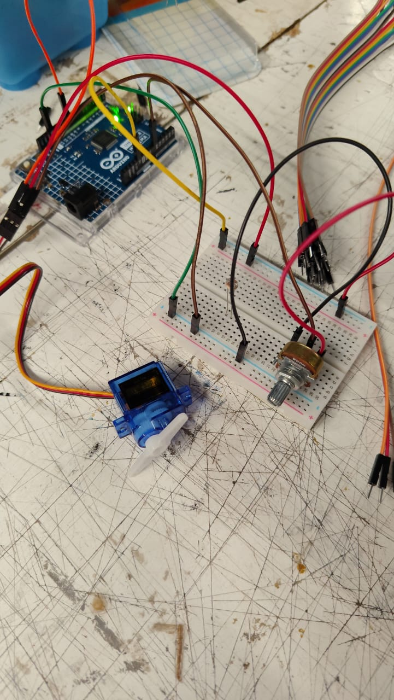
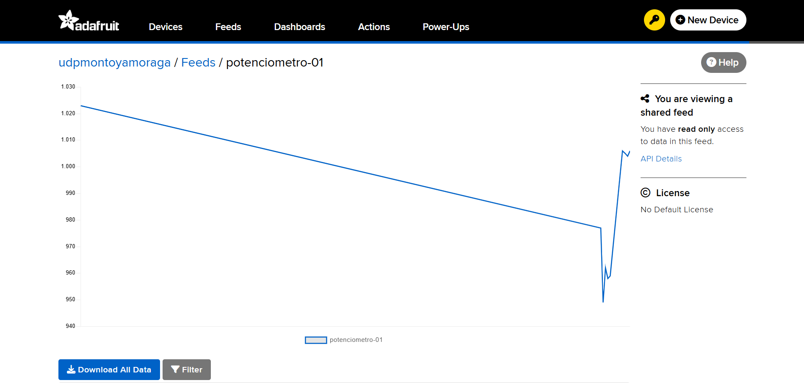

# sesion-07

lunes 20 abril 2026

## Apuntes de clase

entrega de materiales como grupo 1

Potenciómetro tiene 3 patitas, por lo general se conecta la 2 y otra de algún extremo.

LDR (resistencia), protoboard y cables.

Motor servo.

Protoboard o breadboard: está separado en mini placas de metal donde circulan los electrones.

El Arduino y la Raspberry Pi se colocan en el lugar del Arduino, en voltaje positivo, y el otro jumper en tierra.

Dividir por colores para no perderse en las conexiones.

Lo que conecte en cada espacio de la protoboard va a seguir con la continuidad.

App gratuita Tinkercad.

Distintas secciones.

Potenciómetro, nos aseguramos que esté en 3 lugares distintos.

Le agregamos código al Arduino.
```
// ejemplo lectura potenciometro

// queremos que nuestro Arduino
// sea capaz de leer un potenciometro
// conectado a la entrada A0.

int lectura = 0;


void setup()
{
  pinMode(LED_BUILTIN, OUTPUT);
  Serial.begin(9600);
}

void loop()
{
  lectura = analogRead(A0);
  Serial.println(lectura);
}
```


Y luego utilizamos un nuevo código para colocar el motor servo.

```
// ejemplo lectura potenciometro

// queremos que nuestro Arduino
// sea capaz de leer un potenciometro
// conectado a la entrada A0.


#include <Servo.h>


Servo miServo;

int lectura = 0;
int angulo = 0;


void setup()
{
  pinMode(9, OUTPUT);
  Serial.begin(9600);
  // en que patita esta conectado el servo
  // conectemos a patita 9 digital
  miServo.attach(9);
  
}

void loop()
{
  // leer
  lectura = analogRead(A0);
  
  // imprimir en consola
  Serial.println(lectura);
  
  
  // toma el valor de lectura
  // que va originalmente entre 0 y 1023
  // y mapealo al rango 0 a 180
  angulo = map(lectura, 0, 1023, 0, 180);
    
  // pidele por favor al servo
  // que vaya a ese angulo
  miServo.write(angulo);
  
  // servo descansa un poquito
  // 15 milisegundos
  // la vida es dura
  delay(15);
    
}
```

Después con el potenciómetro que está en la protoboard hicimos que se moviera el motor.



Para finalizar subimos el código a la nube con nuestro grupo.


