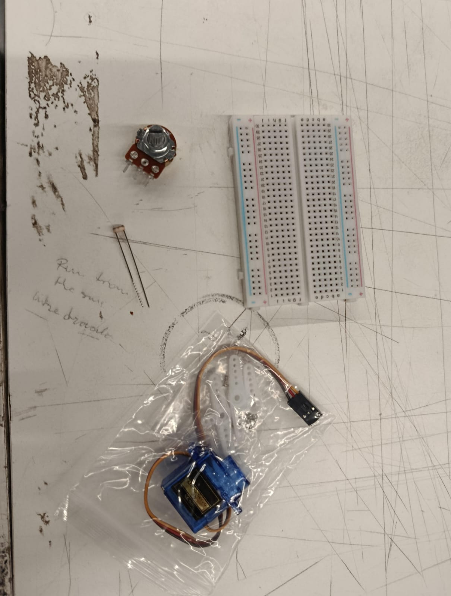
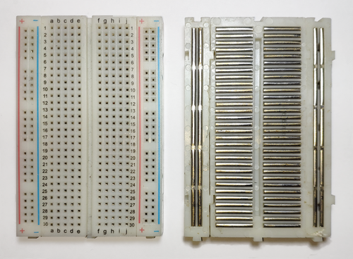
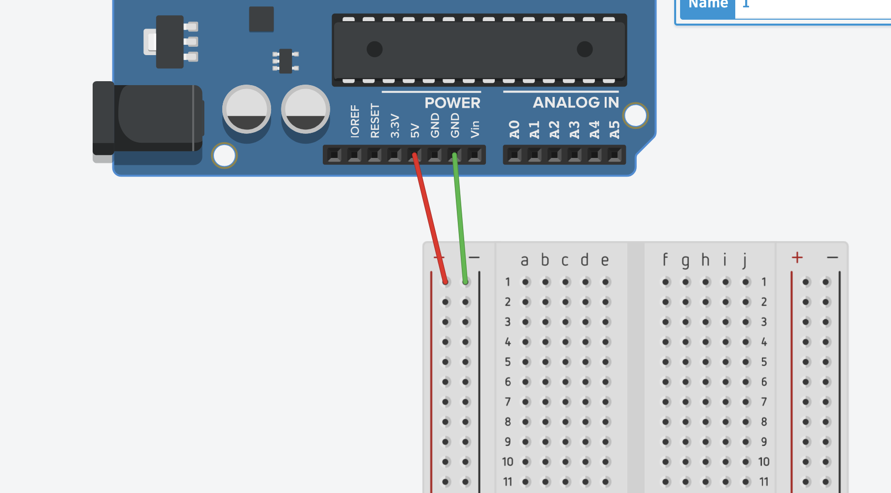
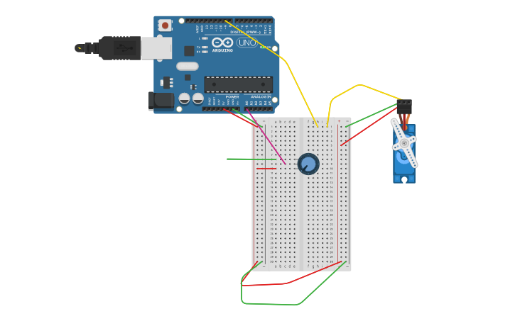

# sesion-07

lunes 20 abril 2026
# Solemne 2: Interacciones con Sensores

## Kit entregado en clases
El kit utilizado incluye los siguientes componentes:

- **Potenciómetro**: Permite variar la resistencia y controlar valores dentro de un circuito.
- **LDR (Light Dependent Resistor)**: Sensor que cambia su resistencia dependiendo de la cantidad de luz.
- **Protoboard (Placa de pruebas)**: Permite realizar conexiones sin necesidad de soldar.
- **Servo / Motor**: Dispositivo que necesita alimentación (voltaje) y conexión a tierra para funcionar.

---

## Conceptos clave

### Protoboard (Placa de pruebas)
- Es una herramienta para armar circuitos electrónicos de forma temporal.
- Funciona como una **máquina de repetición**, ya que las filas están conectadas internamente por metal.
- Los puntos en una misma fila están eléctricamente conectados.
- Las conexiones no son permanentes, lo que permite modificar el circuito fácilmente.

### Polaridad
- **Rojo** → Positivo (+)
- **Verde o negro** → Tierra / Negativo (−)

### Voltaje
- Usar más voltaje no siempre mejora el funcionamiento.
- Es importante respetar el voltaje adecuado para cada componente.

---

## Simulación de circuitos

Puedes simular circuitos de forma virtual usando Tinkercad:

https://www.tinkercad.com/things/cxK06CpZWMv-potenciometrobacan?sharecode=_fCnbfoSH2dyMvwvdq2yVC_J_kIDv-dC0dRYN3ER70Y

---

## Recomendación
Revisar los apuntes de la asignatura **Máquinas en Diseño UDP** para complementar estos contenidos.

### Ejercicicos en clases 

https://github.com/user-attachments/assets/ef11a73e-cc90-4aab-90f0-cbc011e4b33e

